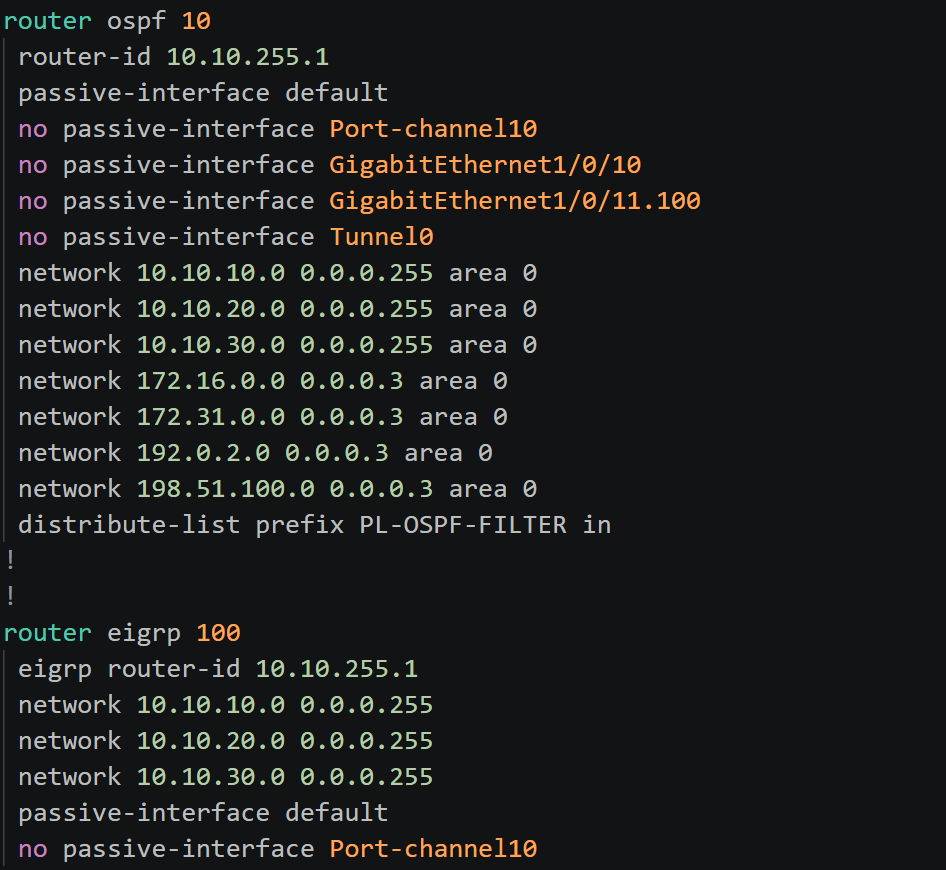
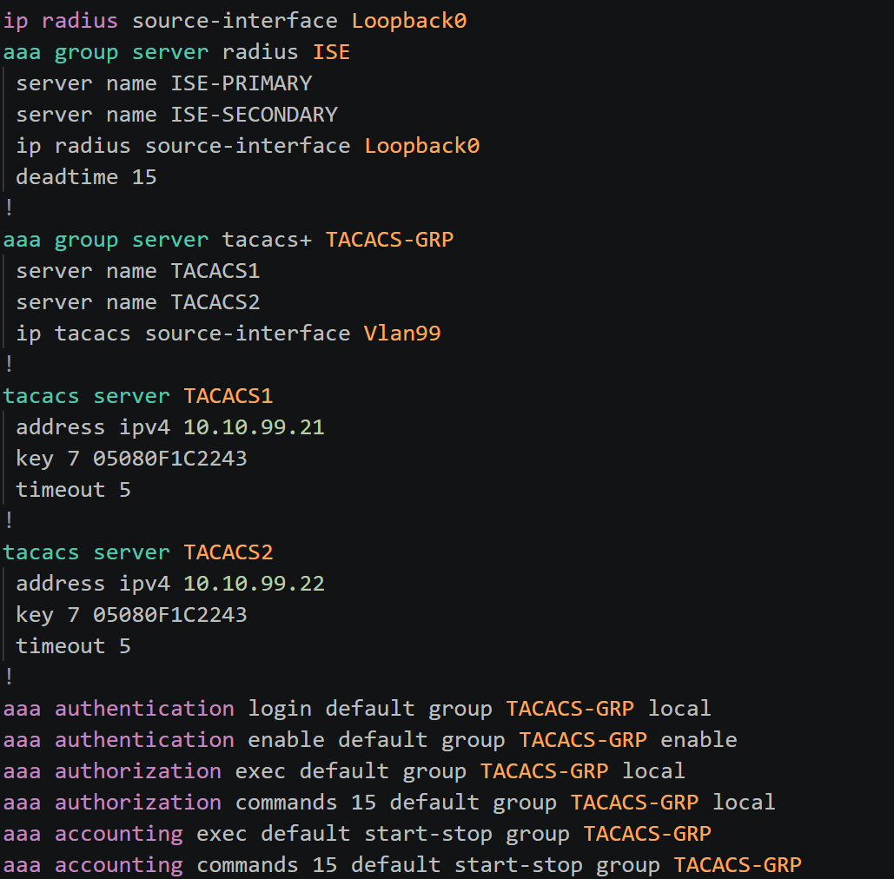

# Cisco IOS-XE Syntax Highlighting

Syntax highlighting for Cisco IOS and IOS XE configuration files in Visual Studio Code.

This extension is built around practical configuration review: important structures, values, and operationally significant commands should be easy to find without turning the entire configuration into visual noise.

> **Preview:** Syntax coverage is actively being expanded. The extension is useful today, but it does not attempt to recognize every command or abbreviation supported by Cisco IOS and IOS XE.

## Features

- Highlights common IOS and IOS XE configuration contexts and commands.
- Distinguishes interfaces, IP addresses, VLANs, routing processes, ACLs, AAA servers, and other frequently reviewed values.
- Makes operationally significant keywords stand out.
- Highlights Cisco `!` comment lines.
- Highlights full-line Jinja2 comments (`{# ... #}`) commonly used in Ansible templates.
- Supports `.ios`, `.iosxe`, `.cisco`, `iosj2`, `iosxej2`, and `.ciscoj2` files.

Highlighting colors are provided by your active VS Code theme. Because themes assign colors differently, the exact appearance may vary.

## Example
> Below configurations are generated by AI, and are not representative of production network configurations. Highlighting showcases `VSCode Dark 2026` themes, different themes will have different appearances.

### Routing Process configuration hightlighting:

---
---


### AAA configuration highlighting:


## Design approach

Cisco IOS accepts many abbreviated commands. This grammar intentionally focuses on canonical commands and a small number of common abbreviations rather than every syntactically valid shortening.

For example, IOS may accept all of the following:

```text
int
inte
inter
interf
interfa
interfac
interface
```

This extension currently recognizes `int` and `interface`. This keeps the grammar understandable and reduces ambiguous matches.

Highlighting indicates that text is structurally or operationally significant; it does **not** validate whether a configuration is correct or safe.

## Getting started

Open a file with one of the supported extensions:

```text
router.ios
switch.iosxe
access-template.cisco
```

You can also assign the language manually from the language selector in the lower-right corner of VS Code by choosing **Cisco IOS-XE**.

For other filenames, add a VS Code file association:

```json
"files.associations": {
    "*.cfg": "cisco-iosxe",
    "*.conf": "cisco-iosxe"
}
```

## Current limitations

- Syntax coverage is incomplete and will grow incrementally.
- The grammar is a highlighter, not a parser, linter, formatter, or configuration validator.
- Most noncanonical command abbreviations are not recognized.
- Jinja2 support is currently limited to full-line comments.
- Some commands are context-sensitive in IOS but may be highlighted more broadly by this grammar.

## Feedback and contributions

Bug reports, missing command examples, and focused improvements are welcome through the project's issue tracker. When reporting a highlighting problem, include a small sanitized configuration sample and describe which token should be highlighted differently.

## Release history

See [CHANGELOG.md](CHANGELOG.md) for version history.

## License

Released under the MIT License. See [LICENSE](LICENSE).

Cisco, Cisco IOS, and Cisco IOS XE are trademarks of Cisco Systems, Inc. This independent project is not affiliated with or endorsed by Cisco Systems.