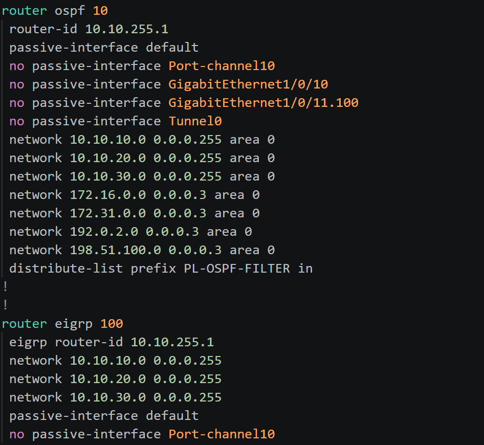
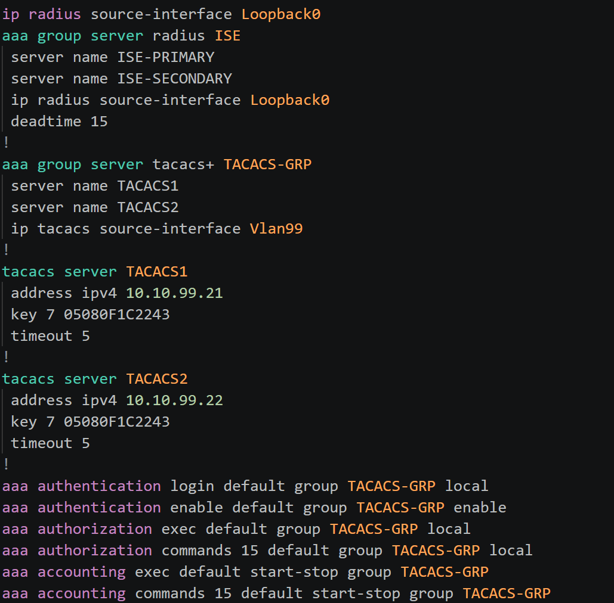

# Cisco IOS-XE Syntax Highlighting (Preview)

Syntax highlighting for Cisco IOS and IOS XE configuration files in Visual Studio Code.

This extension helps you review configurations by making important commands, structures, and values easier to find while keeping the highlighting focused.

> **Preview:** Syntax coverage is actively being expanded. The extension recognizes common commands and selected abbreviations, but does not cover every command supported by Cisco IOS and IOS XE.

## Features

- Highlights common IOS and IOS XE configuration commands.
- Distinguishes interface names, IPv4 addresses and CIDR prefixes, VLAN IDs, routing processes, VRFs, ACLs, and AAA servers.
- Highlights names in class maps, policy maps, templates, and NetFlow configurations.
- Makes operationally significant keywords such as `no`, `shutdown`, `permit`, and `deny` stand out.
- Highlights Cisco `!` comment lines.
- Provides basic highlighting for Jinja2 variables, control statements, and full-line comments commonly used in Ansible templates.
- Supports `.ios`, `.iosxe`, `.cisco`, `.iosj2`, `.iosxej2`, and `.ciscoj2` files.

Colors come from your active VS Code theme, so the appearance varies between themes.

## Getting started

Open a file with one of the supported extensions, such as:

```text
router.ios
switch.iosxe
access-template.cisco
switch-template.iosj2
```

You can also select **Cisco IOS-XE** from the language selector in the lower-right corner of VS Code.

To use other file extensions, add file associations to your VS Code `settings.json`:

```json
{
  "files.associations": {
    "*.cfg": "cisco-iosxe",
    "*.conf": "cisco-iosxe"
  }
}
```

If your settings file already contains other settings or a `files.associations` entry, merge these associations into the existing configuration.

## Examples

The screenshots below use the VS Code Dark 2026 theme. The configurations were generated with AI to demonstrate highlighting and are not intended for production use.

### Routing configuration



### AAA configuration



## Design approach

Cisco IOS accepts many abbreviated commands. This grammar focuses on canonical commands and selected common abbreviations to keep the rules understandable and reduce ambiguous matches.

For example, the interface command can have several abbreviated forms:

```text
int
inte
inter
interf
interfa
interfac
interface
```

The extension targets `int` and `interface`; intermediate abbreviations are outside its intended coverage.

Highlighting identifies significant text. It does **not** validate whether a configuration is correct or safe.

## Current limitations

- Command coverage is incomplete and will grow incrementally.
- The extension provides syntax highlighting only; it does not parse, lint, format, or validate configurations.
- Most noncanonical command abbreviations are outside the intended coverage.
- Some commands are context-sensitive in IOS but may be highlighted more broadly by the grammar.
- Jinja2 support covers selected forms rather than the full template language.

## Feedback and contributions

Bug reports, missing command examples, and focused improvements are welcome through the [issue tracker](https://github.com/buildsthenetwork/cisco-ios-xe-syntax-highlighter/issues).

When reporting a highlighting problem, include a small sanitized configuration sample, describe the expected highlighting, and identify your VS Code theme. Remove credentials and other sensitive information from examples before sharing them.

## Release history

See [CHANGELOG.md](CHANGELOG.md) for version history.

## License

Released under the [MIT License](LICENSE).

Cisco, Cisco IOS, and Cisco IOS XE are trademarks of Cisco Systems, Inc. This independent project is not affiliated with or endorsed by Cisco Systems.
